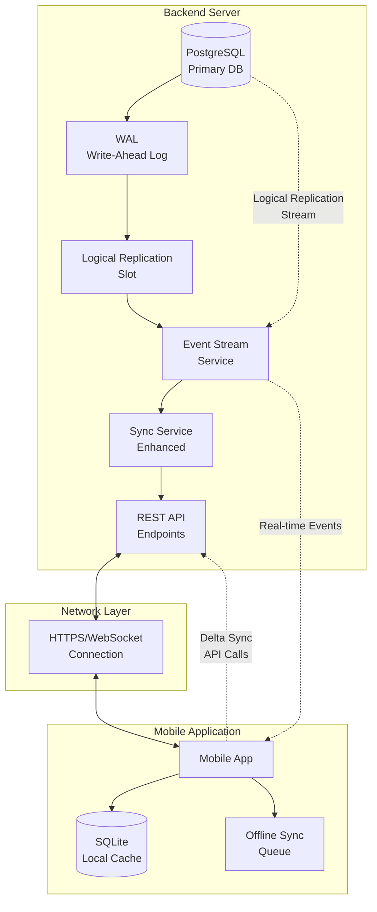
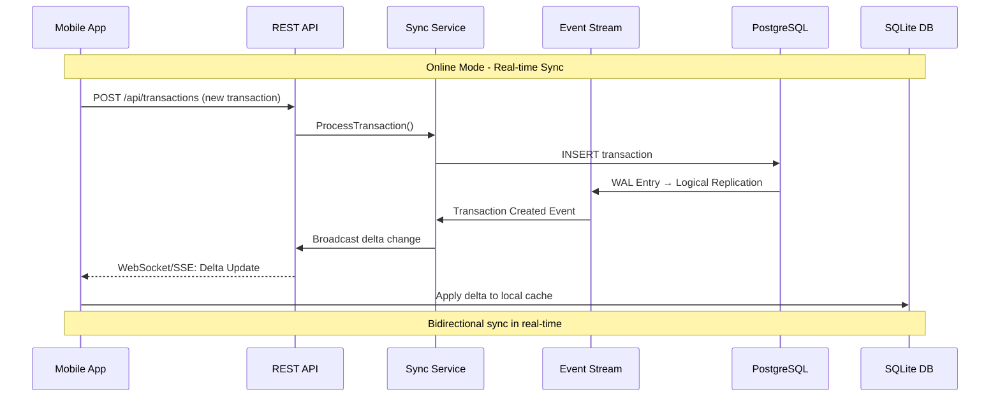
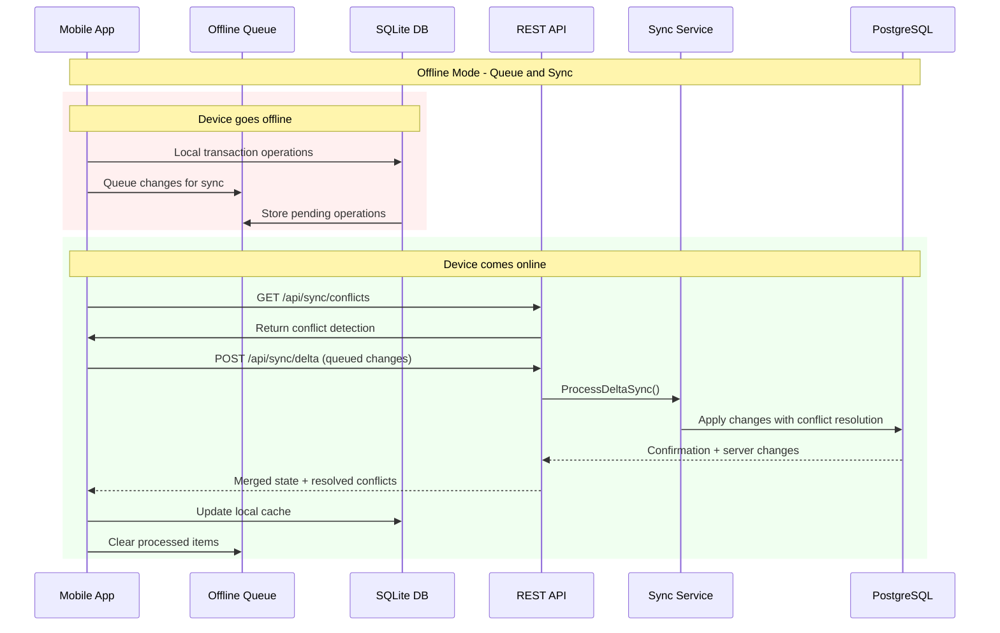

# Panduan Transisi Arsitektur Sinkronisasi Data: Dari Polling ke Event-Driven

## Daftar Isi

1. [Penjelasan Konseptual](#1-penjelasan-konseptual)
2. [Diagram Arsitektur](#2-diagram-arsitektur)
3. [Detail Implementasi Teknis](#3-detail-implementasi-teknis)
4. [Strategi Penanganan Error dan Konflik](#4-strategi-penanganan-error-dan-konflik)
5. [Langkah Implementasi](#5-langkah-implementasi)
6. [Testing dan Monitoring](#6-testing-dan-monitoring)

---

## 1. Penjelasan Konseptual

### 1.1 Mengapa Beralih ke Event-Driven Architecture?

**Masalah Arsitektur Polling Saat Ini:**

- **Inefficient Resource Usage:** Sync service melakukan polling secara periodik bahkan ketika tidak ada perubahan data
- **Latency Issues:** Delay antara perubahan data dan sinkronisasi tergantung pada interval polling
- **Scalability Problems:** Semakin banyak klien, semakin tinggi beban server untuk polling
- **Bandwidth Waste:** Transfer data penuh pada setiap sync, bukan hanya delta changes

**Keuntungan Event-Driven Architecture:**

- **Real-time Synchronization:** Perubahan data langsung memicu event untuk sinkronisasi
- **Efficient Delta Sync:** Hanya mengirim perubahan data yang spesifik
- **Better Scalability:** Multiple subscribers dapat menerima event tanpa overhead tambahan
- **Reduced Server Load:** Eliminasi unnecessary polling requests

### 1.2 Konsep Event-Driven Synchronization

**Event-Driven Model** menggunakan **Change Data Capture (CDC)** melalui PostgreSQL Logical Replication untuk:

1. **Mendeteksi Perubahan:** Setiap INSERT, UPDATE, DELETE di PostgreSQL menghasilkan WAL entry
2. **Generate Events:** Logical replication stream membaca WAL dan mengkonversi ke events
3. **Distribute Changes:** Events dikirim ke subscribers (mobile apps) secara real-time
4. **Apply Locally:** Mobile apps mengaplikasikan delta changes ke SQLite local

**Architecture Pattern:**

```
PostgreSQL (Source) → Logical Replication → Event Stream → Mobile App (Target)
```

---

## 2. Diagram Arsitektur

### 2.1 Arsitektur Overview



### 2.2 Data Flow - Online Mode



### 2.3 Data Flow - Offline Mode



---

## 3. Detail Implementasi Teknis

### 3.1 PostgreSQL Logical Replication Setup

#### 3.1.1 Database Configuration

**Konfigurasi postgresql.conf:**

```ini
# Logical Replication Settings
wal_level = logical
max_replication_slots = 10
max_wal_senders = 10
max_worker_processes = 10

# Security Settings
ssl = on
ssl_cert_file = 'server.crt'
ssl_key_file = 'server.key'
```

**Update .env untuk replication:**

```env
# Existing database config
DB_HOST=localhost
DB_PORT=5435
DB_USER=postgres
DB_PASSWORD=postgres
DB_NAME=tpos_db
DB_SSL_MODE=require

# Logical Replication Config
DB_REPLICATION_USER=replication_user
DB_REPLICATION_PASSWORD=replication_pass
DB_REPLICATION_SLOT_NAME=tpos_sync_slot
DB_REPLICATION_PUBLICATION=tpos_publication
```

#### 3.1.2 SQL Setup Commands

```sql
-- 1. Create replication user
CREATE ROLE replication_user WITH REPLICATION LOGIN PASSWORD 'replication_pass';

-- 2. Grant permissions on tables
GRANT SELECT ON ALL TABLES IN SCHEMA public TO replication_user;
GRANT USAGE ON SCHEMA public TO replication_user;

-- 3. Create publication for all tables
CREATE PUBLICATION tpos_publication FOR ALL TABLES;

-- 4. Create replication slot
SELECT pg_create_logical_replication_slot('tpos_sync_slot', 'pgoutput');

-- 5. Verify setup
SELECT slot_name, plugin, slot_type, active
FROM pg_replication_slots
WHERE slot_name = 'tpos_sync_slot';
```

### 3.2 Go Implementation - Enhanced Sync Service

#### 3.2.1 Event Stream Service

**File: `internal/application/services/event_stream_service.go`**

```go
package services

import (
    "context"
    "encoding/json"
    "fmt"
    "log"
    "time"

    "github.com/jackc/pgx/v5"
    "github.com/jackc/pgx/v5/pgxpool"
    "github.com/terminator791/t-pos/internal/domain/dto"
)

type EventStreamService struct {
    replicationConn *pgx.Conn
    pool            *pgxpool.Pool
    slotName        string
    publication     string
    subscribers     map[string]chan dto.SyncEvent
    ctx             context.Context
    cancel          context.CancelFunc
}

type SyncEvent struct {
    EventType   string      `json:"event_type"`   // INSERT, UPDATE, DELETE
    TableName   string      `json:"table_name"`
    EntityID    string      `json:"entity_id"`
    OldData     interface{} `json:"old_data,omitempty"`
    NewData     interface{} `json:"new_data,omitempty"`
    Timestamp   time.Time   `json:"timestamp"`
    ShopID      string      `json:"shop_id"`
    LSN         string      `json:"lsn"`          // Log Sequence Number
}

func NewEventStreamService(pool *pgxpool.Pool, config ReplicationConfig) *EventStreamService {
    ctx, cancel := context.WithCancel(context.Background())

    return &EventStreamService{
        pool:        pool,
        slotName:    config.SlotName,
        publication: config.Publication,
        subscribers: make(map[string]chan dto.SyncEvent),
        ctx:         ctx,
        cancel:      cancel,
    }
}

func (es *EventStreamService) StartReplicationStream() error {
    // Create dedicated replication connection
    connConfig, err := pgx.ParseConfig(es.buildReplicationConnString())
    if err != nil {
        return fmt.Errorf("failed to parse replication config: %w", err)
    }

    es.replicationConn, err = pgx.ConnectConfig(es.ctx, connConfig)
    if err != nil {
        return fmt.Errorf("failed to connect for replication: %w", err)
    }

    // Start logical replication
    go es.consumeLogicalReplication()

    return nil
}

func (es *EventStreamService) consumeLogicalReplication() {
    defer es.replicationConn.Close(es.ctx)

    query := fmt.Sprintf(
        "START_REPLICATION SLOT %s LOGICAL 0/0 (proto_version '1', publication_names '%s')",
        es.slotName, es.publication,
    )

    rows, err := es.replicationConn.Query(es.ctx, query)
    if err != nil {
        log.Printf("Failed to start replication: %v", err)
        return
    }
    defer rows.Close()

    for rows.Next() {
        select {
        case <-es.ctx.Done():
            return
        default:
            if err := es.processReplicationMessage(rows); err != nil {
                log.Printf("Error processing replication message: %v", err)
            }
        }
    }
}

func (es *EventStreamService) processReplicationMessage(rows pgx.Rows) error {
    // Parse logical replication message
    // This is a simplified version - actual implementation needs to parse
    // the binary logical replication protocol

    var lsn string
    var data []byte

    if err := rows.Scan(&lsn, &data); err != nil {
        return err
    }

    // Parse the logical replication data and convert to SyncEvent
    event, err := es.parseLogicalMessage(lsn, data)
    if err != nil {
        return err
    }

    // Broadcast to all subscribers
    es.broadcastEvent(event)

    return nil
}

func (es *EventStreamService) parseLogicalMessage(lsn string, data []byte) (dto.SyncEvent, error) {
    // Implementation to parse pgoutput format
    // This would need to handle the binary protocol for logical replication
    // For simplicity, showing the structure

    var event dto.SyncEvent
    event.LSN = lsn
    event.Timestamp = time.Now()

    // Parse based on pgoutput protocol
    // Handle BEGIN, COMMIT, INSERT, UPDATE, DELETE messages

    return event, nil
}

func (es *EventStreamService) Subscribe(clientID string) <-chan dto.SyncEvent {
    es.subscribers[clientID] = make(chan dto.SyncEvent, 100)
    return es.subscribers[clientID]
}

func (es *EventStreamService) Unsubscribe(clientID string) {
    if ch, exists := es.subscribers[clientID]; exists {
        close(ch)
        delete(es.subscribers, clientID)
    }
}

func (es *EventStreamService) broadcastEvent(event dto.SyncEvent) {
    for clientID, ch := range es.subscribers {
        select {
        case ch <- event:
        default:
            log.Printf("Client %s channel full, dropping event", clientID)
        }
    }
}

func (es *EventStreamService) buildReplicationConnString() string {
    return fmt.Sprintf(
        "host=%s port=%d user=%s password=%s dbname=%s replication=database sslmode=require",
        os.Getenv("DB_HOST"),
        getEnvAsInt("DB_PORT", 5432),
        os.Getenv("DB_REPLICATION_USER"),
        os.Getenv("DB_REPLICATION_PASSWORD"),
        os.Getenv("DB_NAME"),
    )
}
```

#### 3.2.2 Enhanced Sync Service

**Perbarui file: `internal/application/services/sync_service.go`**

```go
// Tambahkan ke struct SyncService
type SyncService struct {
    // ... existing fields ...
    eventStream     *EventStreamService
    deltaProcessor  *DeltaProcessor
    conflictResolver *ConflictResolver
}

// Tambahkan method baru untuk event-driven sync
func (s *SyncService) ProcessRealtimeEvent(event dto.SyncEvent) error {
    // Filter events by shop_id for multi-tenancy
    if !s.isEventRelevantForShop(event) {
        return nil
    }

    // Process based on event type
    switch event.EventType {
    case "INSERT":
        return s.handleInsertEvent(event)
    case "UPDATE":
        return s.handleUpdateEvent(event)
    case "DELETE":
        return s.handleDeleteEvent(event)
    default:
        return fmt.Errorf("unknown event type: %s", event.EventType)
    }
}

func (s *SyncService) handleInsertEvent(event dto.SyncEvent) error {
    // Convert event data to appropriate DTO
    entityData, err := s.convertEventToEntity(event)
    if err != nil {
        return err
    }

    // Create delta sync entry
    delta := dto.DeltaChange{
        EntityType: event.TableName,
        EntityID:   event.EntityID,
        Operation:  "INSERT",
        NewData:    entityData,
        Timestamp:  event.Timestamp,
        ShopID:     event.ShopID,
        LSN:        event.LSN,
    }

    return s.deltaProcessor.ProcessDelta(delta)
}

func (s *SyncService) handleUpdateEvent(event dto.SyncEvent) error {
    delta := dto.DeltaChange{
        EntityType: event.TableName,
        EntityID:   event.EntityID,
        Operation:  "UPDATE",
        OldData:    event.OldData,
        NewData:    event.NewData,
        Timestamp:  event.Timestamp,
        ShopID:     event.ShopID,
        LSN:        event.LSN,
    }

    return s.deltaProcessor.ProcessDelta(delta)
}

func (s *SyncService) handleDeleteEvent(event dto.SyncEvent) error {
    delta := dto.DeltaChange{
        EntityType: event.TableName,
        EntityID:   event.EntityID,
        Operation:  "DELETE",
        OldData:    event.OldData,
        Timestamp:  event.Timestamp,
        ShopID:     event.ShopID,
        LSN:        event.LSN,
    }

    return s.deltaProcessor.ProcessDelta(delta)
}
```

#### 3.2.3 Delta Processor

**File: `internal/application/services/delta_processor.go`**

```go
package services

import (
    "context"
    "encoding/json"
    "fmt"
    "time"

    "github.com/google/uuid"
    "github.com/terminator791/t-pos/internal/domain/dto"
    "gorm.io/gorm"
)

type DeltaProcessor struct {
    db    *gorm.DB
    cache *SyncCacheManager
}

type DeltaChange struct {
    ID         uuid.UUID   `json:"id"`
    EntityType string      `json:"entity_type"`
    EntityID   string      `json:"entity_id"`
    Operation  string      `json:"operation"` // INSERT, UPDATE, DELETE
    OldData    interface{} `json:"old_data,omitempty"`
    NewData    interface{} `json:"new_data,omitempty"`
    Timestamp  time.Time   `json:"timestamp"`
    ShopID     string      `json:"shop_id"`
    LSN        string      `json:"lsn"`
    Applied    bool        `json:"applied"`
    CreatedAt  time.Time   `json:"created_at"`
}

func NewDeltaProcessor(db *gorm.DB, cache *SyncCacheManager) *DeltaProcessor {
    return &DeltaProcessor{
        db:    db,
        cache: cache,
    }
}

func (dp *DeltaProcessor) ProcessDelta(delta dto.DeltaChange) error {
    // Store delta for offline clients
    if err := dp.storeDelta(delta); err != nil {
        return fmt.Errorf("failed to store delta: %w", err)
    }

    // Cache for quick retrieval
    return dp.cache.CacheDelta(delta)
}

func (dp *DeltaProcessor) storeDelta(delta dto.DeltaChange) error {
    deltaRecord := DeltaChange{
        ID:         uuid.New(),
        EntityType: delta.EntityType,
        EntityID:   delta.EntityID,
        Operation:  delta.Operation,
        OldData:    delta.OldData,
        NewData:    delta.NewData,
        Timestamp:  delta.Timestamp,
        ShopID:     delta.ShopID,
        LSN:        delta.LSN,
        Applied:    false,
        CreatedAt:  time.Now(),
    }

    return dp.db.Create(&deltaRecord).Error
}

func (dp *DeltaProcessor) GetDeltasSince(shopID string, sinceTimestamp time.Time, limit int) ([]dto.DeltaChange, error) {
    var deltas []DeltaChange

    err := dp.db.Where("shop_id = ? AND timestamp > ? AND applied = false", shopID, sinceTimestamp).
        Order("timestamp ASC").
        Limit(limit).
        Find(&deltas).Error

    if err != nil {
        return nil, err
    }

    // Convert to DTO
    var deltaDTOs []dto.DeltaChange
    for _, delta := range deltas {
        deltaDTOs = append(deltaDTOs, dto.DeltaChange{
            EntityType: delta.EntityType,
            EntityID:   delta.EntityID,
            Operation:  delta.Operation,
            OldData:    delta.OldData,
            NewData:    delta.NewData,
            Timestamp:  delta.Timestamp,
            ShopID:     delta.ShopID,
            LSN:        delta.LSN,
        })
    }

    return deltaDTOs, nil
}

func (dp *DeltaProcessor) MarkDeltasApplied(deltaIDs []string) error {
    return dp.db.Model(&DeltaChange{}).
        Where("id IN ?", deltaIDs).
        Update("applied", true).Error
}
```

### 3.3 HTTP API Endpoints

#### 3.3.1 Sync Handler Enhancement

**Perbarui file: `internal/interfaces/http/handlers/sync_handler.go`**

```go
// Tambahkan method baru untuk delta sync
func (h *SyncHandler) HandleDeltaSync(c *gin.Context) {
    var request dto.DeltaSyncRequest
    if err := c.ShouldBindJSON(&request); err != nil {
        h.respondError(c, http.StatusBadRequest, "Invalid request format", err)
        return
    }

    // Get user context
    userID, shopID, err := h.getUserContext(c)
    if err != nil {
        h.respondError(c, http.StatusUnauthorized, "Unauthorized", err)
        return
    }

    // Validate request
    if err := h.validateDeltaSyncRequest(request); err != nil {
        h.respondError(c, http.StatusBadRequest, "Invalid sync request", err)
        return
    }

    // Process delta synchronization
    response, err := h.syncService.ProcessDeltaSync(c.Request.Context(), dto.DeltaSyncParams{
        UserID:        userID,
        ShopID:        shopID,
        LastSyncTime:  request.LastSyncTime,
        ClientDeltas:  request.ClientDeltas,
        ConflictStrategy: request.ConflictStrategy,
    })

    if err != nil {
        h.respondError(c, http.StatusInternalServerError, "Delta sync failed", err)
        return
    }

    c.JSON(http.StatusOK, gin.H{
        "success": true,
        "data":    response,
    })
}

func (h *SyncHandler) HandleRealtimeEvents(c *gin.Context) {
    // Upgrade to WebSocket connection for real-time events
    upgrader := websocket.Upgrader{
        CheckOrigin: func(r *http.Request) bool {
            return true // Configure based on your security needs
        },
    }

    conn, err := upgrader.Upgrade(c.Writer, c.Request, nil)
    if err != nil {
        log.Printf("Failed to upgrade to websocket: %v", err)
        return
    }
    defer conn.Close()

    userID, shopID, err := h.getUserContext(c)
    if err != nil {
        conn.WriteMessage(websocket.TextMessage, []byte("Unauthorized"))
        return
    }

    clientID := fmt.Sprintf("%s_%s", userID, shopID)

    // Subscribe to event stream
    eventChan := h.eventStream.Subscribe(clientID)
    defer h.eventStream.Unsubscribe(clientID)

    // Send events to client
    for {
        select {
        case event := <-eventChan:
            // Filter events for this shop
            if event.ShopID != shopID {
                continue
            }

            if err := conn.WriteJSON(event); err != nil {
                log.Printf("Failed to send event to client %s: %v", clientID, err)
                return
            }
        case <-c.Request.Context().Done():
            return
        }
    }
}

func (h *SyncHandler) HandleConflictResolution(c *gin.Context) {
    var request dto.ConflictResolutionRequest
    if err := c.ShouldBindJSON(&request); err != nil {
        h.respondError(c, http.StatusBadRequest, "Invalid request format", err)
        return
    }

    userID, shopID, err := h.getUserContext(c)
    if err != nil {
        h.respondError(c, http.StatusUnauthorized, "Unauthorized", err)
        return
    }

    resolution, err := h.syncService.ResolveConflicts(c.Request.Context(), dto.ConflictResolutionParams{
        UserID:    userID,
        ShopID:    shopID,
        Conflicts: request.Conflicts,
        Strategy:  request.Strategy,
    })

    if err != nil {
        h.respondError(c, http.StatusInternalServerError, "Conflict resolution failed", err)
        return
    }

    c.JSON(http.StatusOK, gin.H{
        "success": true,
        "data":    resolution,
    })
}
```

#### 3.3.2 Route Registration

**Perbarui routes untuk delta sync:**

```go
// Tambahkan ke router setup
syncGroup := v1.Group("/sync")
syncGroup.Use(authMiddleware)
{
    syncGroup.POST("/delta", syncHandler.HandleDeltaSync)
    syncGroup.GET("/events", syncHandler.HandleRealtimeEvents)
    syncGroup.POST("/conflicts/resolve", syncHandler.HandleConflictResolution)
    syncGroup.GET("/status", syncHandler.HandleSyncStatus)
}
```

---

## 4. Strategi Penanganan Error dan Konflik

### 4.1 Error Handling Strategy

#### 4.1.1 Connection Failures

**Replication Connection Resilience:**

```go
type ReplicationManager struct {
    conn            *pgx.Conn
    reconnectDelay  time.Duration
    maxRetries      int
    currentRetries  int
}

func (rm *ReplicationManager) handleConnectionFailure() {
    for rm.currentRetries < rm.maxRetries {
        log.Printf("Replication connection failed, retrying in %v (attempt %d/%d)",
                   rm.reconnectDelay, rm.currentRetries+1, rm.maxRetries)

        time.Sleep(rm.reconnectDelay)

        if err := rm.reconnect(); err == nil {
            log.Println("Replication connection restored")
            rm.currentRetries = 0
            return
        }

        rm.currentRetries++
        rm.reconnectDelay *= 2 // Exponential backoff
    }

    log.Printf("Failed to restore replication connection after %d attempts", rm.maxRetries)
    // Fallback to polling mode or alert system administrators
    rm.fallbackToPolling()
}

func (rm *ReplicationManager) fallbackToPolling() {
    // Temporarily switch back to polling until replication is restored
    log.Println("Switching to fallback polling mode")
    // Implementation to activate polling sync
}
```

#### 4.1.2 Event Processing Failures

```go
type EventProcessor struct {
    deadLetterQueue chan dto.SyncEvent
    retryQueue      chan dto.SyncEvent
    maxRetries      int
}

func (ep *EventProcessor) processEventWithRetry(event dto.SyncEvent) error {
    var lastError error

    for attempt := 0; attempt <= ep.maxRetries; attempt++ {
        if err := ep.processEvent(event); err == nil {
            return nil
        } else {
            lastError = err
            log.Printf("Event processing failed (attempt %d/%d): %v",
                      attempt+1, ep.maxRetries+1, err)

            if attempt < ep.maxRetries {
                time.Sleep(time.Duration(attempt+1) * time.Second)
            }
        }
    }

    // Send to dead letter queue for manual processing
    ep.deadLetterQueue <- event
    return fmt.Errorf("event processing failed after %d attempts: %w", ep.maxRetries+1, lastError)
}
```

### 4.2 Conflict Resolution Strategy

#### 4.2.1 Conflict Detection

```go
type ConflictDetector struct {
    db *gorm.DB
}

type ConflictType string

const (
    ConflictTypeUpdate          ConflictType = "UPDATE_CONFLICT"
    ConflictTypeDelete          ConflictType = "DELETE_CONFLICT"
    ConflictTypeConcurrentEdit  ConflictType = "CONCURRENT_EDIT"
    ConflictTypeVersionMismatch ConflictType = "VERSION_MISMATCH"
)

type DataConflict struct {
    ID           uuid.UUID     `json:"id"`
    EntityType   string        `json:"entity_type"`
    EntityID     string        `json:"entity_id"`
    ConflictType ConflictType  `json:"conflict_type"`
    ServerData   interface{}   `json:"server_data"`
    ClientData   interface{}   `json:"client_data"`
    ServerTime   time.Time     `json:"server_time"`
    ClientTime   time.Time     `json:"client_time"`
    ShopID       string        `json:"shop_id"`
}

func (cd *ConflictDetector) DetectConflicts(clientChanges []dto.DeltaChange, shopID string) ([]DataConflict, error) {
    var conflicts []DataConflict

    for _, clientChange := range clientChanges {
        // Get current server state
        serverData, serverTime, err := cd.getServerEntityState(clientChange.EntityType, clientChange.EntityID)
        if err != nil {
            return nil, err
        }

        // Check for conflicts
        if conflict := cd.checkForConflict(clientChange, serverData, serverTime); conflict != nil {
            conflicts = append(conflicts, *conflict)
        }
    }

    return conflicts, nil
}

func (cd *ConflictDetector) checkForConflict(clientChange dto.DeltaChange, serverData interface{}, serverTime time.Time) *DataConflict {
    // Version-based conflict detection
    if cd.hasVersionMismatch(clientChange, serverData) {
        return &DataConflict{
            ID:           uuid.New(),
            EntityType:   clientChange.EntityType,
            EntityID:     clientChange.EntityID,
            ConflictType: ConflictTypeVersionMismatch,
            ServerData:   serverData,
            ClientData:   clientChange.NewData,
            ServerTime:   serverTime,
            ClientTime:   clientChange.Timestamp,
            ShopID:       clientChange.ShopID,
        }
    }

    // Timestamp-based conflict detection
    if serverTime.After(clientChange.Timestamp) {
        return &DataConflict{
            ID:           uuid.New(),
            EntityType:   clientChange.EntityType,
            EntityID:     clientChange.EntityID,
            ConflictType: ConflictTypeConcurrentEdit,
            ServerData:   serverData,
            ClientData:   clientChange.NewData,
            ServerTime:   serverTime,
            ClientTime:   clientChange.Timestamp,
            ShopID:       clientChange.ShopID,
        }
    }

    return nil
}
```

#### 4.2.2 Conflict Resolution Strategies

```go
type ConflictResolver struct {
    db *gorm.DB
}

type ResolutionStrategy string

const (
    StrategyServerWins      ResolutionStrategy = "SERVER_WINS"
    StrategyClientWins      ResolutionStrategy = "CLIENT_WINS"
    StrategyLastWriteWins   ResolutionStrategy = "LAST_WRITE_WINS"
    StrategyManualResolve   ResolutionStrategy = "MANUAL_RESOLVE"
    StrategyMergeFields     ResolutionStrategy = "MERGE_FIELDS"
)

func (cr *ConflictResolver) ResolveConflicts(conflicts []DataConflict, strategy ResolutionStrategy) ([]dto.ConflictResolution, error) {
    var resolutions []dto.ConflictResolution

    for _, conflict := range conflicts {
        resolution, err := cr.resolveConflict(conflict, strategy)
        if err != nil {
            return nil, err
        }
        resolutions = append(resolutions, resolution)
    }

    return resolutions, nil
}

func (cr *ConflictResolver) resolveConflict(conflict DataConflict, strategy ResolutionStrategy) (dto.ConflictResolution, error) {
    switch strategy {
    case StrategyServerWins:
        return dto.ConflictResolution{
            ConflictID:     conflict.ID,
            ResolvedData:   conflict.ServerData,
            ResolutionType: "SERVER_WINS",
            Timestamp:      time.Now(),
        }, nil

    case StrategyClientWins:
        // Apply client changes to server
        if err := cr.applyClientData(conflict); err != nil {
            return dto.ConflictResolution{}, err
        }
        return dto.ConflictResolution{
            ConflictID:     conflict.ID,
            ResolvedData:   conflict.ClientData,
            ResolutionType: "CLIENT_WINS",
            Timestamp:      time.Now(),
        }, nil

    case StrategyLastWriteWins:
        if conflict.ServerTime.After(conflict.ClientTime) {
            return cr.resolveConflict(conflict, StrategyServerWins)
        }
        return cr.resolveConflict(conflict, StrategyClientWins)

    case StrategyMergeFields:
        mergedData, err := cr.mergeConflictData(conflict)
        if err != nil {
            return dto.ConflictResolution{}, err
        }
        return dto.ConflictResolution{
            ConflictID:     conflict.ID,
            ResolvedData:   mergedData,
            ResolutionType: "FIELD_MERGE",
            Timestamp:      time.Now(),
        }, nil

    default:
        return dto.ConflictResolution{
            ConflictID:     conflict.ID,
            ResolvedData:   nil,
            ResolutionType: "MANUAL_REQUIRED",
            Timestamp:      time.Now(),
        }, nil
    }
}

func (cr *ConflictResolver) mergeConflictData(conflict DataConflict) (interface{}, error) {
    // Field-level merge logic based on entity type
    switch conflict.EntityType {
    case "products":
        return cr.mergeProductFields(conflict.ServerData, conflict.ClientData)
    case "transactions":
        return cr.mergeTransactionFields(conflict.ServerData, conflict.ClientData)
    default:
        // Default to server data for unknown entities
        return conflict.ServerData, nil
    }
}

func (cr *ConflictResolver) mergeProductFields(serverData, clientData interface{}) (interface{}, error) {
    // Example field-level merge for products
    // Merge non-conflicting fields, use business rules for conflicting ones

    serverProduct := serverData.(dto.SyncProductDTO)
    clientProduct := clientData.(dto.SyncProductDTO)

    merged := serverProduct // Start with server data

    // Use client data for specific fields (example business rule)
    if clientProduct.Stock != serverProduct.Stock {
        // Use the higher stock value (or implement more complex logic)
        if clientProduct.Stock > serverProduct.Stock {
            merged.Stock = clientProduct.Stock
        }
    }

    // Always use the latest price from client if it was updated
    merged.Sale = clientProduct.Sale
    merged.Buy = clientProduct.Buy

    return merged, nil
}
```

### 4.3 Offline Sync Recovery

#### 4.3.1 Offline Queue Management

```go
type OfflineSyncManager struct {
    db                *gorm.DB
    maxQueueSize      int
    compressionLevel  int
}

type OfflineOperation struct {
    ID          uuid.UUID `json:"id"`
    UserID      uuid.UUID `json:"user_id"`
    ShopID      uuid.UUID `json:"shop_id"`
    EntityType  string    `json:"entity_type"`
    EntityID    string    `json:"entity_id"`
    Operation   string    `json:"operation"`
    Data        []byte    `json:"data"`         // Compressed JSON
    Timestamp   time.Time `json:"timestamp"`
    Retries     int       `json:"retries"`
    Status      string    `json:"status"`       // PENDING, SYNCED, FAILED
    CreatedAt   time.Time `json:"created_at"`
}

func (osm *OfflineSyncManager) QueueOperation(userID, shopID uuid.UUID, entityType, entityID, operation string, data interface{}) error {
    // Check queue size limit
    if count, err := osm.getQueueSize(userID, shopID); err != nil {
        return err
    } else if count >= osm.maxQueueSize {
        return fmt.Errorf("offline queue is full (max %d operations)", osm.maxQueueSize)
    }

    // Compress data
    jsonData, err := json.Marshal(data)
    if err != nil {
        return err
    }

    compressedData, err := osm.compressData(jsonData)
    if err != nil {
        return err
    }

    operation := OfflineOperation{
        ID:         uuid.New(),
        UserID:     userID,
        ShopID:     shopID,
        EntityType: entityType,
        EntityID:   entityID,
        Operation:  operation,
        Data:       compressedData,
        Timestamp:  time.Now(),
        Status:     "PENDING",
        CreatedAt:  time.Now(),
    }

    return osm.db.Create(&operation).Error
}

func (osm *OfflineSyncManager) ProcessOfflineQueue(userID, shopID uuid.UUID) error {
    var operations []OfflineOperation

    err := osm.db.Where("user_id = ? AND shop_id = ? AND status = ?", userID, shopID, "PENDING").
        Order("timestamp ASC").
        Find(&operations).Error
    if err != nil {
        return err
    }

    for _, op := range operations {
        if err := osm.processOfflineOperation(op); err != nil {
            log.Printf("Failed to process offline operation %s: %v", op.ID, err)
            // Mark for retry or manual intervention
            osm.markOperationFailed(op.ID)
        } else {
            osm.markOperationSynced(op.ID)
        }
    }

    return nil
}
```

---

## 5. Langkah Implementasi

### 5.1 Phase 1: Infrastructure Setup (Week 1-2)

#### Day 1-3: PostgreSQL Logical Replication Setup

1. **Database Configuration**

   ```bash
   # Update postgresql.conf
   sudo nano /etc/postgresql/13/main/postgresql.conf

   # Add logical replication settings
   wal_level = logical
   max_replication_slots = 10
   max_wal_senders = 10

   # Restart PostgreSQL
   sudo systemctl restart postgresql
   ```

2. **Create Replication User and Publication**

   ```sql
   -- Connect as postgres superuser
   psql -U postgres -d tpos_db

   -- Execute setup commands
   \i scripts/setup_logical_replication.sql
   ```

3. **Update Environment Configuration**
   ```bash
   # Update .env file
   echo "DB_REPLICATION_USER=replication_user" >> .env
   echo "DB_REPLICATION_PASSWORD=replication_pass" >> .env
   echo "DB_REPLICATION_SLOT_NAME=tpos_sync_slot" >> .env
   echo "DB_REPLICATION_PUBLICATION=tpos_publication" >> .env
   ```

#### Day 4-7: Core Event Stream Implementation

1. **Create Event Stream Service**

   ```bash
   # Create new files
   touch internal/application/services/event_stream_service.go
   touch internal/application/services/delta_processor.go
   touch internal/domain/dto/event_dto.go
   ```

2. **Implement Basic Event Processing**
   - Event stream connection management
   - Basic message parsing
   - Event broadcasting to subscribers

#### Day 8-14: Integration with Existing Sync Service

1. **Enhance Sync Service**

   - Add event-driven capabilities
   - Maintain backward compatibility
   - Implement feature flags for gradual rollout

2. **Database Schema Updates**

   ```sql
   -- Create delta changes table
   CREATE TABLE delta_changes (
       id UUID PRIMARY KEY DEFAULT gen_random_uuid(),
       entity_type VARCHAR(50) NOT NULL,
       entity_id VARCHAR(255) NOT NULL,
       operation VARCHAR(10) NOT NULL,
       old_data JSONB,
       new_data JSONB,
       timestamp TIMESTAMP WITH TIME ZONE NOT NULL,
       shop_id UUID NOT NULL,
       lsn VARCHAR(255),
       applied BOOLEAN DEFAULT FALSE,
       created_at TIMESTAMP WITH TIME ZONE DEFAULT NOW()
   );

   CREATE INDEX idx_delta_changes_shop_timestamp ON delta_changes(shop_id, timestamp);
   CREATE INDEX idx_delta_changes_applied ON delta_changes(applied);
   ```

### 5.2 Phase 2: API Enhancement (Week 3-4)

#### Week 3: REST API Endpoints

1. **New Sync Endpoints**

   ```go
   // Add to routes
   POST   /api/v1/sync/delta
   GET    /api/v1/sync/events (WebSocket upgrade)
   POST   /api/v1/sync/conflicts/resolve
   GET    /api/v1/sync/status
   ```

2. **Implement Delta Sync Logic**
   - Request/response DTOs
   - Validation logic
   - Error handling

#### Week 4: Real-time Communication

1. **WebSocket Implementation**

   - Connection management
   - Event filtering by shop
   - Connection pooling

2. **Conflict Resolution API**
   - Conflict detection algorithms
   - Resolution strategies
   - Manual conflict resolution UI support

### 5.3 Phase 3: Testing and Optimization (Week 5-6)

#### Week 5: Testing

1. **Unit Tests**

   ```bash
   # Run existing tests
   go test ./internal/application/services/...

   # Add new test files
   touch internal/application/services/event_stream_service_test.go
   touch internal/application/services/delta_processor_test.go
   ```

2. **Integration Tests**
   - Database replication setup
   - End-to-end sync flow
   - Conflict resolution scenarios

#### Week 6: Performance Optimization

1. **Performance Tuning**
   - Connection pooling optimization
   - Event batching strategies
   - Memory usage optimization

### 5.4 Phase 4: Production Rollout (Week 7-8)

#### Week 7: Staged Deployment

1. **Feature Flags Implementation**

   ```go
   type SyncConfig struct {
       EnableEventDriven    bool `env:"ENABLE_EVENT_DRIVEN" default:"false"`
       EnableRealtimeSync   bool `env:"ENABLE_REALTIME_SYNC" default:"false"`
       FallbackToPolling    bool `env:"FALLBACK_TO_POLLING" default:"true"`
   }
   ```

2. **Gradual Rollout Strategy**
   - Start with 10% of users
   - Monitor metrics and errors
   - Gradually increase to 100%

#### Week 8: Monitoring and Support

1. **Production Monitoring**

   - Error tracking and notifications

2. **Documentation and Training**
   - Update API documentation
   - Create troubleshooting guides
   - Train support team

---

## 6. Testing dan Monitoring

### 6.1 Testing Strategy

#### 6.1.1 Unit Tests

```go
// File: internal/application/services/event_stream_service_test.go
package services

import (
    "testing"
    "time"

    "github.com/stretchr/testify/assert"
    "github.com/stretchr/testify/mock"
)

func TestEventStreamService_ProcessReplicationMessage(t *testing.T) {
    tests := []struct {
        name           string
        inputLSN       string
        inputData      []byte
        expectedEvent  dto.SyncEvent
        expectedError  error
    }{
        {
            name:      "valid insert event",
            inputLSN:  "0/1234567",
            inputData: mockInsertMessage(),
            expectedEvent: dto.SyncEvent{
                EventType: "INSERT",
                TableName: "products",
                EntityID:  "123e4567-e89b-12d3-a456-426614174000",
                LSN:       "0/1234567",
            },
            expectedError: nil,
        },
        // Add more test cases
    }

    for _, tt := range tests {
        t.Run(tt.name, func(t *testing.T) {
            service := NewEventStreamService(mockPool, mockConfig)

            event, err := service.parseLogicalMessage(tt.inputLSN, tt.inputData)

            assert.Equal(t, tt.expectedError, err)
            assert.Equal(t, tt.expectedEvent.EventType, event.EventType)
            assert.Equal(t, tt.expectedEvent.TableName, event.TableName)
        })
    }
}
```

#### 6.1.2 Integration Tests

```go
// File: tests/integration/sync_integration_test.go
package integration

import (
    "context"
    "testing"
    "time"

    "github.com/testcontainers/testcontainers-go"
    "github.com/testcontainers/testcontainers-go/modules/postgres"
)

func TestEventDrivenSync_EndToEnd(t *testing.T) {
    // Setup test database with logical replication
    ctx := context.Background()

    pgContainer, err := postgres.RunContainer(ctx,
        testcontainers.WithImage("postgres:13"),
        postgres.WithDatabase("testdb"),
        postgres.WithUsername("testuser"),
        postgres.WithPassword("testpass"),
        testcontainers.WithWaitStrategy(wait.ForLog("database system is ready to accept connections")),
    )
    require.NoError(t, err)
    defer pgContainer.Terminate(ctx)

    // Setup logical replication
    connStr, err := pgContainer.ConnectionString(ctx)
    require.NoError(t, err)

    db := setupTestDatabase(connStr)
    defer db.Close()

    // Setup event stream service
    eventStream := NewEventStreamService(db, testConfig)
    err = eventStream.StartReplicationStream()
    require.NoError(t, err)

    // Test data insertion triggers event
    productID := uuid.New()
    product := entities.Product{
        ID:     productID,
        ShopID: testShopID,
        Name:   "Test Product",
        Sale:   100.0,
    }

    // Insert product
    err = db.Create(&product).Error
    require.NoError(t, err)

    // Wait for event
    select {
    case event := <-eventStream.Subscribe("test-client"):
        assert.Equal(t, "INSERT", event.EventType)
        assert.Equal(t, "products", event.TableName)
        assert.Equal(t, productID.String(), event.EntityID)
    case <-time.After(5 * time.Second):
        t.Fatal("Timeout waiting for event")
    }
}
```

### 6.2 Monitoring Implementation

#### 6.2.1 Health Checks

```go
// File: internal/health/sync_health.go
package health

import (
    "context"
    "fmt"
    "time"

    "github.com/terminator791/t-pos/internal/application/services"
)

type SyncHealthChecker struct {
    eventStream     *services.EventStreamService
    replicationConn *pgx.Conn
}

type HealthStatus struct {
    Status             string    `json:"status"`
    ReplicationActive  bool      `json:"replication_active"`
    ReplicationLag     string    `json:"replication_lag"`
    LastEventTime      time.Time `json:"last_event_time"`
    ConnectedClients   int       `json:"connected_clients"`
    QueuedEvents       int       `json:"queued_events"`
    ErrorCount         int       `json:"error_count_last_hour"`
}

func (shc *SyncHealthChecker) CheckHealth(ctx context.Context) (*HealthStatus, error) {
    status := &HealthStatus{
        Status: "healthy",
    }

    // Check replication slot status
    if active, lag, err := shc.checkReplicationStatus(ctx); err != nil {
        status.Status = "unhealthy"
        return status, err
    } else {
        status.ReplicationActive = active
        status.ReplicationLag = lag.String()
    }

    // Check event stream status
    status.ConnectedClients = shc.eventStream.GetConnectedClientCount()
    status.QueuedEvents = shc.eventStream.GetQueuedEventCount()
    status.LastEventTime = shc.eventStream.GetLastEventTime()

    // Check error rates
    status.ErrorCount = shc.getErrorCountLastHour()

    if !status.ReplicationActive || status.ErrorCount > 100 {
        status.Status = "degraded"
    }

    return status, nil
}

func (shc *SyncHealthChecker) checkReplicationStatus(ctx context.Context) (bool, time.Duration, error) {
    query := `
        SELECT active,
               EXTRACT(EPOCH FROM (now() - confirmed_flush_lsn::text::timestamp))::int as lag_seconds
        FROM pg_replication_slots
        WHERE slot_name = $1
    `

    var active bool
    var lagSeconds int

    err := shc.replicationConn.QueryRow(ctx, query, "tpos_sync_slot").Scan(&active, &lagSeconds)
    if err != nil {
        return false, 0, err
    }

    return active, time.Duration(lagSeconds) * time.Second, nil
}
```

---

## Kesimpulan

Dokumen ini menyediakan panduan komprehensif untuk mentransisikan arsitektur sinkronisasi data T-POS dari model polling ke event-driven menggunakan PostgreSQL Logical Replication. Implementasi ini akan meningkatkan efisiensi, mengurangi latency, dan menyediakan sinkronisasi real-time antara backend dan aplikasi mobile.

### Key Benefits:

- **Real-time synchronization** dengan latency minimal
- **Efficient bandwidth usage** melalui delta sync
- **Improved scalability** untuk multiple mobile clients
- **Robust conflict resolution** untuk scenario offline/online
- **Comprehensive monitoring** dan error handling

Implementasi ini mempertahankan backward compatibility dengan sistem existing sambil mempersiapkan infrastruktur untuk pertumbuhan dan skalabilitas masa depan.
