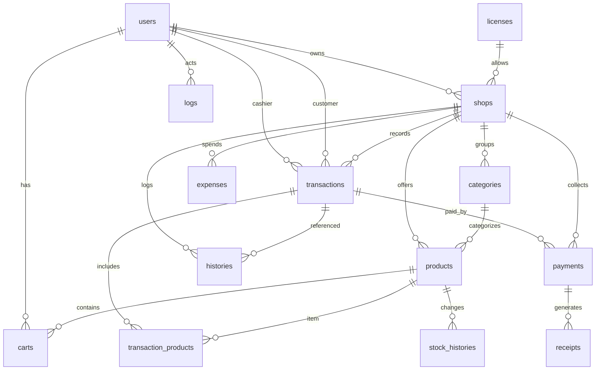

## Domain Overview

Point‑of‑sale (POS) with shops, products, transactions, payments, receipts, stock tracking, expenses, licensing, and audit logs.

---

## Canonical YAML Schema

```yaml
schema_version: 1
engine: mysql8
collation: utf8mb4_unicode_ci
name: backend-t-pos-vue
entities:
  users:
    pk: [id]
    description: Application users (owner, admin, cashier, client).
    fields:
      id:            {type: uuid, nullable: false}
      license_id:    {type: uuid, nullable: true}
      email:         {type: string, maxLen: 255, unique: true, nullable: true}
      email_verified_at: {type: timestamp, nullable: true}
      username:      {type: string, maxLen: 255, nullable: true}
      name:          {type: string, maxLen: 255, nullable: false}
      password:      {type: string, maxLen: 255, nullable: false, privacy: hashed}
      pin:           {type: int, nullable: true, semantics: pin_code}
      info_device:   {type: string, maxLen: 255, nullable: true}
      fcm_token:     {type: string, maxLen: 255, nullable: true}
      remember_token:{type: string, maxLen: 100, nullable: true}
      created_at:    {type: timestamp, nullable: true}
      updated_at:    {type: timestamp, nullable: true}
    indexes:
      - {name: users_email_unique, fields: [email], unique: true}
      - {name: users_name_index,   fields: [name]}
      - {name: users_created_at_index, fields: [created_at]}
    relations:
      license: {type: many_to_one, target: licenses, fk: license_id, on_delete: cascade}

  licenses:
    pk: [id]
    description: License identifiers that gate shop ownership/usage.
    fields:
      id:            {type: uuid, nullable: false}
      serial_number: {type: string, maxLen: 50, nullable: false}
      created_at:    {type: timestamp, nullable: true}
      updated_at:    {type: timestamp, nullable: true}

  license_logs:
    pk: [id]
    description: Log of license generation/assignment per user.
    fields:
      id:            {type: uuid, nullable: false}
      user_id:       {type: uuid, nullable: true}
      license_id:    {type: uuid, nullable: true}
      generate_date: {type: datetime, nullable: true}
      created_at:    {type: timestamp, nullable: true}
      updated_at:    {type: timestamp, nullable: true}
    indexes:
      - {name: license_logs_license_id_foreign, fields: [license_id]}
      - {name: license_logs_user_id_foreign, fields: [user_id]}
    relations:
      user:    {type: many_to_one, target: users, fk: user_id, on_delete: cascade, on_update: cascade}
      license: {type: many_to_one, target: licenses, fk: license_id, on_delete: cascade, on_update: cascade}

  shops:
    pk: [id]
    description: Merchant shops operating under a license.
    fields:
      id:            {type: bigint, unsigned: true}
      license_id:    {type: uuid}
      user_id:       {type: uuid, description: owner_user_id}
      name:          {type: string, maxLen: 255}
      photo:         {type: string, maxLen: 255, nullable: true}
      address:       {type: text, nullable: true}
      slogan:        {type: string, maxLen: 255, nullable: true}
      profit_calculate: {type: bigint, default: 0, semantics: toggle_or_mode}
      created_at:    {type: timestamp, nullable: true}
      updated_at:    {type: timestamp, nullable: true}
    indexes:
      - {name: shops_license_id_foreign, fields: [license_id]}
      - {name: shops_user_id_foreign, fields: [user_id]}
    relations:
      license: {type: many_to_one, target: licenses, fk: license_id, on_delete: cascade}
      owner:   {type: many_to_one, target: users,    fk: user_id,    on_delete: cascade}

  categories:
    pk: [id]
    description: Product categories per shop.
    fields:
      id:        {type: bigint, unsigned: true}
      shop_id:   {type: bigint, unsigned: true}
      name:      {type: string, maxLen: 255}
      created_at:{type: timestamp, nullable: true}
      updated_at:{type: timestamp, nullable: true}
    indexes:
      - {name: categories_shop_id_foreign, fields: [shop_id]}
    relations:
      shop: {type: many_to_one, target: shops, fk: shop_id, on_delete: cascade}

  products:
    pk: [id]
    description: Sellable items.
    fields:
      id:         {type: bigint, unsigned: true}
      shop_id:    {type: bigint, unsigned: true}
      cat_id:     {type: bigint, unsigned: true, nullable: true}
      photo:      {type: string, maxLen: 255, nullable: true}
      name:       {type: string, maxLen: 255}
      barcode:    {type: string, maxLen: 255, nullable: true}
      unit:       {type: string, maxLen: 50,  nullable: true}
      ppn:        {type: decimal(5,2), nullable: true, semantics: tax_percent}
      sale:       {type: decimal(10,2)}
      buy:        {type: decimal(10,2)}
      profit:     {type: decimal(10,2), nullable: true}
      stock:      {type: int, default: 0}
      is_schedule:{type: bool, default: false}
      schedule:   {type: json, nullable: true}
      qty:        {type: int, nullable: true}
      isHaveStock:{type: bool, default: true, alias: has_stock}
      created_at: {type: timestamp, nullable: true}
      updated_at: {type: timestamp, nullable: true}
    indexes:
      - {name: products_cat_id_foreign, fields: [cat_id]}
      - {name: products_name_index, fields: [name]}
      - {name: products_barcode_index, fields: [barcode]}
      - {name: products_created_at_index, fields: [created_at]}
      - {name: products_shop_cat_index, fields: [shop_id, cat_id]}
    relations:
      shop:     {type: many_to_one, target: shops,      fk: shop_id, on_delete: cascade}
      category: {type: many_to_one, target: categories, fk: cat_id,  on_delete: set_null}

  carts:
    pk: [id]
    description: User shopping carts (pre‑transaction basket).
    fields:
      id:         {type: bigint, unsigned: true}
      shop_id:    {type: bigint, unsigned: true}
      product_id: {type: bigint, unsigned: true}
      user_id:    {type: uuid}
      created_at: {type: timestamp, nullable: true}
      updated_at: {type: timestamp, nullable: true}
    indexes:
      - {name: carts_product_id_foreign, fields: [product_id]}
      - {name: carts_shop_id_foreign,    fields: [shop_id]}
      - {name: carts_user_created_index, fields: [user_id, created_at]}
    relations:
      product: {type: many_to_one, target: products, fk: product_id, on_delete: cascade}
      shop:    {type: many_to_one, target: shops,    fk: shop_id,    on_delete: cascade}
      user:    {type: many_to_one, target: users,    fk: user_id,    on_delete: cascade}

  transactions:
    pk: [id]
    description: Sales transaction header.
    fields:
      id:                    {type: uuid}
      shop_id:               {type: bigint, unsigned: true}
      cashier_id:            {type: uuid}
      user_id:               {type: uuid, nullable: true, description: customer_user_id}
      discount:              {type: decimal(10,2), default: 0}
      discount_percentage:   {type: decimal(5,2),  default: 0}
      additional_cost:       {type: decimal(10,2), default: 0}
      status:                {type: enum, values: [pending, completed, cancelled, failed], default: pending}
      total_price:           {type: decimal(10,2)}
      profit_transaction:    {type: decimal(10,2), nullable: true}
      cashier_name:          {type: string, maxLen: 255, nullable: true}
      change:                {type: decimal(10,2), nullable: true}
      amount:                {type: bigint, default: 0, semantics: amount_paid}
      initial_payment_status:{type: string, maxLen: 255, nullable: true}
      created_at:            {type: timestamp, nullable: true}
      updated_at:            {type: timestamp, nullable: true}
    indexes:
      - {name: transactions_shop_id_foreign, fields: [shop_id]}
      - {name: transactions_cashier_id_foreign, fields: [cashier_id]}
      - {name: transactions_user_id_foreign, fields: [user_id]}
      - {name: transactions_created_at_index, fields: [created_at]}
    relations:
      shop:    {type: many_to_one, target: shops, fk: shop_id, on_delete: cascade}
      cashier: {type: many_to_one, target: users, fk: cashier_id, on_delete: cascade}
      user:    {type: many_to_one, target: users, fk: user_id, on_delete: cascade}

  transaction_products:
    pk: [id]
    description: Line items per transaction.
    fields:
      id:            {type: bigint, unsigned: true}
      transaction_id:{type: uuid}
      product_id:    {type: bigint, unsigned: true}
      quantity:      {type: int}
      unit_price:    {type: decimal(10,2)}
      total_price:   {type: decimal(10,2)}
      created_at:    {type: timestamp, nullable: true}
      updated_at:    {type: timestamp, nullable: true}
    indexes:
      - {name: transaction_products_transaction_id_foreign, fields: [transaction_id]}
      - {name: transaction_products_product_id_foreign,     fields: [product_id]}
    relations:
      transaction: {type: many_to_one, target: transactions, fk: transaction_id, on_delete: cascade}
      product:     {type: many_to_one, target: products,     fk: product_id,    on_delete: cascade}

  payments:
    pk: [id]
    description: Payments linked to a transaction.
    fields:
      id:            {type: bigint, unsigned: true}
      shop_id:       {type: bigint, unsigned: true}
      user_id:       {type: uuid, nullable: true}
      transaction_id:{type: uuid}
      status:        {type: enum, values: [pending, completed, failed, cancelled], default: pending}
      total:         {type: decimal(10,2)}
      created_at:    {type: timestamp, nullable: true}
      updated_at:    {type: timestamp, nullable: true}
    indexes:
      - {name: payments_shop_id_foreign, fields: [shop_id]}
      - {name: payments_user_id_foreign, fields: [user_id]}
      - {name: payments_transaction_id_foreign, fields: [transaction_id]}
    relations:
      shop:        {type: many_to_one, target: shops,        fk: shop_id,        on_delete: cascade}
      user:        {type: many_to_one, target: users,        fk: user_id,        on_delete: cascade}
      transaction: {type: many_to_one, target: transactions, fk: transaction_id, on_delete: cascade}

  receipts:
    pk: [id]
    description: Receipt record pointing to a payment.
    fields:
      id:         {type: bigint, unsigned: true}
      shop_id:    {type: bigint, unsigned: true}
      payments_id:{type: bigint, unsigned: true}
      created_at: {type: timestamp, nullable: true}
      updated_at: {type: timestamp, nullable: true}
    indexes:
      - {name: receipts_shop_id_foreign, fields: [shop_id]}
      - {name: receipts_payments_id_foreign, fields: [payments_id]}
    relations:
      shop:    {type: many_to_one, target: shops,    fk: shop_id,    on_delete: cascade}
      payment: {type: many_to_one, target: payments, fk: payments_id, on_delete: cascade}

  histories:
    pk: [id]
    description: Lightweight link between shop and transaction for history views.
    fields:
      id:            {type: bigint, unsigned: true}
      shop_id:       {type: bigint, unsigned: true}
      transaction_id:{type: uuid}
      created_at:    {type: timestamp, nullable: true}
      updated_at:    {type: timestamp, nullable: true}
    indexes:
      - {name: histories_shop_id_foreign, fields: [shop_id]}
      - {name: histories_transaction_id_foreign, fields: [transaction_id]}
    relations:
      shop:        {type: many_to_one, target: shops,        fk: shop_id,        on_delete: cascade}
      transaction: {type: many_to_one, target: transactions, fk: transaction_id, on_delete: cascade}

  stock_histories:
    pk: [id]
    description: Append‑only changes to product stock.
    fields:
      id:         {type: bigint, unsigned: true}
      product_id: {type: bigint, unsigned: true}
      stock:      {type: int}
      last_stock: {type: int}
      stocked_at: {type: timestamp}
      created_at: {type: timestamp, nullable: true}
      updated_at: {type: timestamp, nullable: true}
    indexes:
      - {name: stock_histories_product_created_index, fields: [product_id, created_at]}
      - {name: stock_histories_stocked_at_index, fields: [stocked_at]}
    relations:
      product: {type: many_to_one, target: products, fk: product_id, on_delete: cascade}

  expenses:
    pk: [id]
    description: Shop expenses/outflows.
    fields:
      id:         {type: bigint, unsigned: true}
      shop_id:    {type: bigint, unsigned: true}
      nominal:    {type: decimal(10,2)}
      status:     {type: enum, values: [pending, completed, failed, cancelled], default: pending}
      date:       {type: date}
      label:      {type: string, maxLen: 255, nullable: true}
      desc:       {type: text, nullable: true}
      created_at: {type: timestamp, nullable: true}
      updated_at: {type: timestamp, nullable: true}
    indexes:
      - {name: expenses_shop_id_foreign, fields: [shop_id]}
    relations:
      shop: {type: many_to_one, target: shops, fk: shop_id, on_delete: cascade}

  logs:
    pk: [id]
    description: Audit trail of user actions and model changes.
    fields:
      id:          {type: bigint, unsigned: true}
      user_id:     {type: uuid, nullable: true}
      action:      {type: string, maxLen: 255}
      model:       {type: string, maxLen: 255, nullable: true}
      model_id:    {type: uuid,   nullable: true}
      old_values:  {type: json, nullable: true}
      new_values:  {type: json, nullable: true}
      ip_address:  {type: string, maxLen: 255, nullable: true}
      user_agent:  {type: text, nullable: true}
      description: {type: text, nullable: true}
      created_at:  {type: timestamp, nullable: true}
      updated_at:  {type: timestamp, nullable: true}
    indexes:
      - {name: logs_created_at_index, fields: [created_at]}
      - {name: logs_user_created_index, fields: [user_id, created_at]}
      - {name: logs_model_index, fields: [model, model_id]}
    relations:
      user: {type: many_to_one, target: users, fk: user_id, on_delete: set_null}

constraints:
  on_delete:
    cascade: [
      carts.product_id -> products.id,
      carts.shop_id    -> shops.id,
      carts.user_id    -> users.id,
      categories.shop_id -> shops.id,
      expenses.shop_id -> shops.id,
      histories.shop_id -> shops.id,
      histories.transaction_id -> transactions.id,
      license_logs.license_id -> licenses.id,
      license_logs.user_id -> users.id,
      payments.shop_id -> shops.id,
      payments.transaction_id -> transactions.id,
      payments.user_id -> users.id,
      products.shop_id -> shops.id,
      receipts.payments_id -> payments.id,
      receipts.shop_id -> shops.id,
      shops.license_id -> licenses.id,
      shops.user_id -> users.id,
      stock_histories.product_id -> products.id,
      transactions.cashier_id -> users.id,
      transactions.shop_id -> shops.id,
      transactions.user_id -> users.id,
      transaction_products.product_id -> products.id,
      transaction_products.transaction_id -> transactions.id
    ]
  set_null: [
    logs.user_id -> users.id,
    products.cat_id -> categories.id
  ]

semantic_hints:
  money_fields: [products.sale, products.buy, products.profit, transactions.total_price, transactions.profit_transaction, transactions.change, payments.total, expenses.nominal]
  percentage_fields: [products.ppn, transactions.discount_percentage]
  status_fields:
    transactions.status: [pending, completed, cancelled, failed]
    payments.status:     [pending, completed, failed, cancelled]
    expenses.status:     [pending, completed, failed, cancelled]

aliases:
  products.isHaveStock: has_stock
  transactions.user_id: customer_user_id
  shops.user_id: owner_user_id
```

---

## ERD (Mermaid)



---

## Suggestions

- Add `payment_methods` and `payment_details` if supporting cash vs e‑wallet breakdown.
